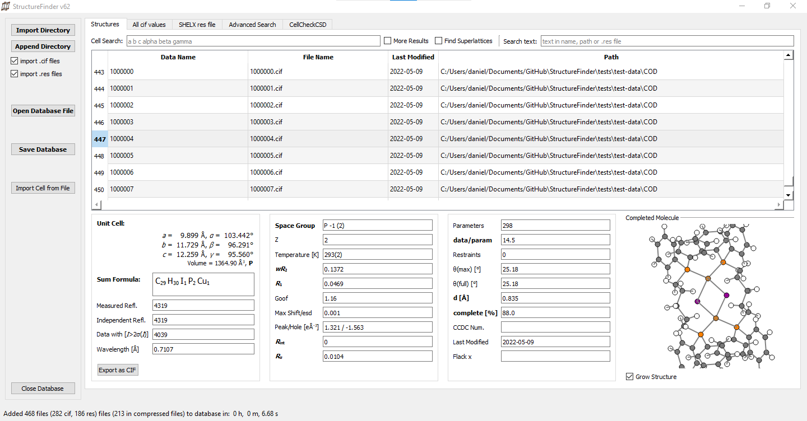
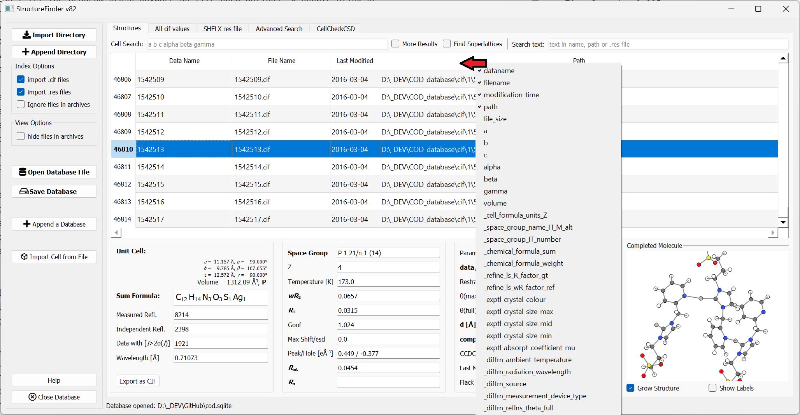
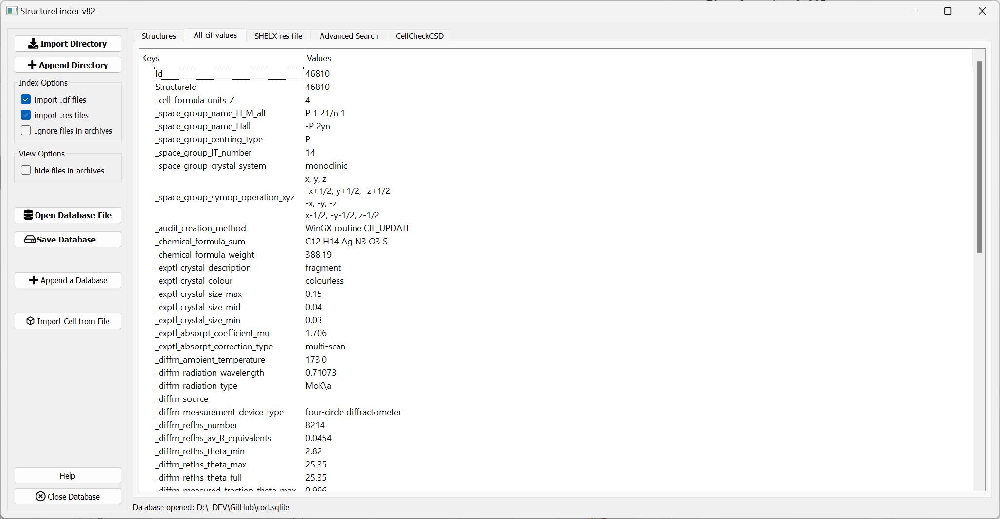
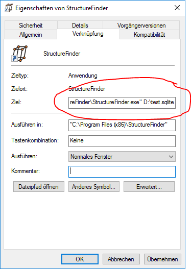

============
Introduction
============
The purpose of StructureFinder is to find crystallographic files such as
`Crystallographic Information Files <https://en.wikipedia.org/wiki/Crystallographic_Information_File>`_ (.cif)
and `SHELX <https://shelx.uni-goettingen.de/>`_ (.res) files.
StructureFinder indexes all .cif and/or .res files below a certain directory (or directories)
and makes them searchable. The intention is not to bring the files in order or
have a static database. It only reflects the order of files in the file system.

StructureFinder is available as a desktop GUI application (``strf``), a
command-line indexer (``strf_cmd``), and a web interface (``strf_web``).

   The StructureFinder main window.

Main Features
-------------

- Index .cif and .res files recursively, including files inside
  .zip, .tar.gz, .tar.bz2, .tgz, and .7z archives
- Unit cell search with lattice matching tolerances
- Text search in file names, directories, and file content
- Advanced multi-parameter search
- Element-based structure search
- CCDC number search
- Author name search
- CSD integration via CellCheckCSD
- Structure visualization with the `fastmolwidget <https://pypi.org/project/fastmolwidget/>`_ viewer
- Plotting of CIF data as scatter plots or histograms
- Export structures as CIF files or table data as Excel (.xlsx) files
- Filter out unrefined structures (without R1 value)
- Customizable table columns
- Open the directory of any structure with a double-click or right-click
- Database merging
- Web interface for team access

The Main Tab
------------

In the main tab, you can import CIF and SHELX .res files to a database and you
can save this database to a file for later usage.

Selecting a certain row of the database shows the unit cell, the residuals and
the asymmetric unit.

A double-click or right-click on a row can open the directory of the
corresponding structure file (only works on the same computer where the files
are stored).

Customizing Columns
-------------------

   List of available columns.

The columns shown in the table can be changed by right-clicking on the table header.
The selected columns will be saved when the application is closed.
Columns are also movable by dragging them to a new position.

All CIF Values Tab
------------------

   List of all CIF values for one structure.

The "All CIF values" tab shows all CIF values available in the database.
These are not necessarily all but most values from the CIF file.

Filtering Structures
--------------------

StructureFinder provides two filter checkboxes:

- **Hide files in archives** – Hides structures that originate from compressed
  archive files.
- **Hide unrefined structures** – Hides structures without an R1 value. This is
  useful, for example, to filter out SHELXT solutions.

Open Database Automatically
---------------------------

If you want to open the same database file with the Windows version, you can add
the database file as a command-line parameter in the start menu shortcut:

Homepage
--------

`Back to the StructureFinder home page <https://dkratzert.de/structurefinder.html>`_
