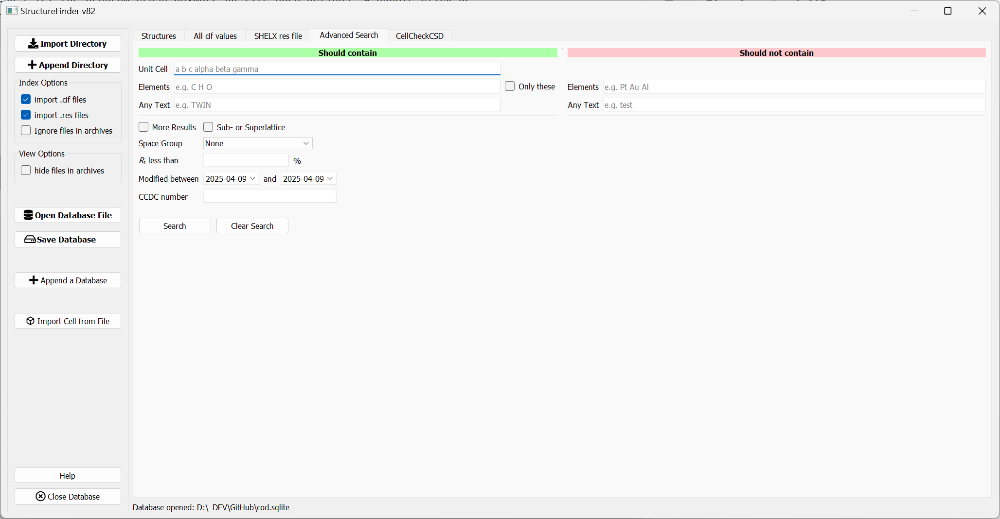

============
Introduction
============
The purpose of StructureFinder is to find crystallograpgic files such as
`Crystallographic Information Files <https://en.wikipedia.org/wiki/Crystallographic_Information_File>`_ (.cif)
and `SHELX <https://shelx.uni-goettingen.de/>`_ (.res) files.
StructureFinder indexes all .cif and/or .res files below a certain directory(s)
and makes them searchable. The intention is not to bring the files in order or
have a static database. It only reflects the order of files in the file system.

.. figure:: pics/strf_1.png
   :width: 700

   The StructureFinder main window.

In the main tab, you can import CIF and SHELX .res files to a database and you
can save this database to a file for later usage.

Selecting a certain row of the database shows the unit cell, the residuals and
the asymmetric unit.

Basic search options for unit cells and text is also available. The cell search
takes six parameters a, b, c, α, β, γ. The search is unsharp so 10 10 10
90 90 90 would find the same cell as 10.00 10.00 10.00 90.00 90.00 90.00.

The algorithm is a combination of a cell comparison by volume first (for speed)
and subsequent matching. The lattice matching implementation was made by the
`pymatgen <http://pymatgen.org/>`_ project.
The tolerances for the cell search are:

regular
volume: ±3 %, length: 0.06 Å, angle: 1.0°

more results option
volume: ±9 %, length: 0.2 Å, angle: 2.0°

The text search field searches in the directory, name and .res file text data.
You can concatenate words with ? and \*. For example foo*bar means
'foo[any text]bar'.

Pro tip: Double click on the unit cell to copy the cell to the clip board.

**Customizing columns**

   List of available columns.

The columns shown in the table can be changed by right-click on the table header.
The selcted columns will be saved during close of the application.

**All CIF values tab**

.. figure:: pics/strf_2.png
   :width: 700

   List of all CIF values for one structure.

The 'All CIF values' tab shows all cif values available in the database.
These are not necessarily all but most values from the cif file.

**Advanced Search**

   Advanced search tab.

The 'Advanced Search' tab allows you to search for several options at a time and
also allows to exclude parameters. I will add more options in the future and I
am open for suggestions for more search options.

Open Database Automatically
---------------------------
If you want to open the same database file with the Windows version, you can add the database file as command line parameter in the start menu shortcut:

.. figure:: pics/strf_4.png
    :scale: 80%
