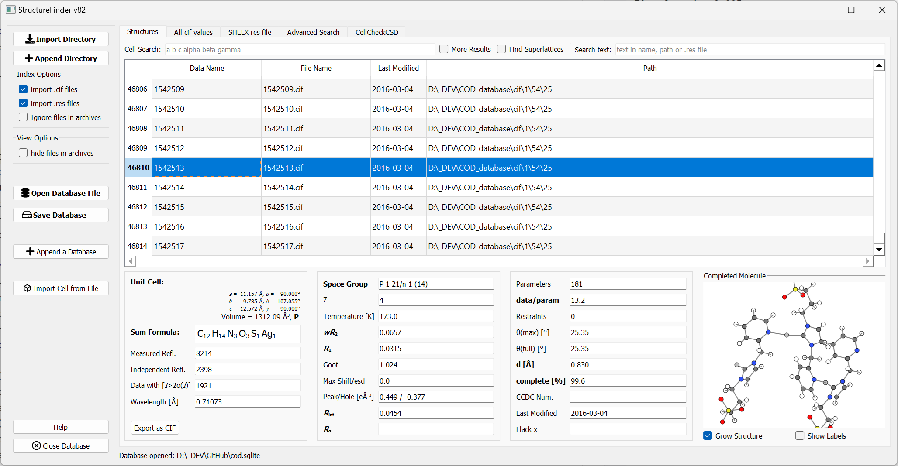

StructureFinder
===============
The purpose of StructureFinder is to find crystallograpgic files such as
`Crystallographic Information Files <https://en.wikipedia.org/wiki/Crystallographic_Information_File>`_ (.cif)
and `SHELX <https://shelx.uni-goettingen.de/>`_ (.res) files.
StructureFinder indexes all .cif and/or .res files below a certain directory(s)
and makes them searchable. The intention is not to bring the files in order or
have a static database. It only reflects the order of files in the file system.

   The StructureFinder main window.

In the main tab, you can import CIF and SHELX .res files to a database and you
can save this database to a file for later usage.

Selecting a certain row of the database shows the unit cell, the residuals and
the asymmetric unit.

Basic search options for unit cells and text is also available. The cell search
takes six parameters a, b, c, α, β, γ. The search is unsharp so 10 10 10
90 90 90 would find the same cell as 10.00 10.00 10.00 90.00 90.00 90.00.

The algorithm is a combination of a cell comparison by volume first (for speed)
and subsequent matching. The lattice matching implementation was made by the
`pymatgen <http://pymatgen.org/>`_ project.
The tolerances for the cell search are:

regular
volume: ±3 %, length: 0.06 Å, angle: 1.0°

more results option
volume: ±9 %, length: 0.2 Å, angle: 2.0°

The text search field searches in the directory, name and .res file text data.
You can concatenate words with ? and \*. For example foo*bar means
'foo[any text]bar'.

Pro tip: Double click on the unit cell to copy the cell to the clip board.

**All CIF values tab**

The 'All CIF values' tab shows all cif values available in the database.
These are not necessarily all but most values from the cif file.

**Advanced Search**

The 'Advanced Search' tab allows you to search for several options at a time and
also allows to exclude parameters. I will add more options in the future and I
am open for suggestions for more search options.

Indexing cif and/or res files
-----------------------------

The 'Import Directory' button starts indexing of .cif or .res files below the
selected directory recursively, depending on which file ending is enabled.
It will scan all subdirectories for .cif/.res files as well as .zip files
containing .cif files. The time for indexing mostly depends on the speed of
your hard drive. Scanning a complete 256 GB SSD takes about 50s. An ten
years old complete file server with over 100 user directories and 20.000
crystal structures can take an hour.

Be aware that the indexing on a network drive is very slow!

Installation
------------

Windows
"""""""
The windows version installs like any other Windows installer.

Linux / Mac / Windows
"""""""""""""""""""""
Since version 73, there is a `pypi <https://pypi.org/project/structurefinder >`_ package for installation in a Python environment.
Do the following steps in order to install and run StructureFinder in any Python environment:

.. code-block::

    >> python -m venv venv
    >> source venv/bin/activate   (Windows: venv\Scripts\activate.bat)
    >> pip install structurefinder
    >> strf  or strf_cmd  or  strf_web

Command Line file Indexer
-------------------------

With the strf_cmd command, you can index directories without a graphical
user interface.

The options -d and -e can be given multiple times like -d /foo -d /bar.

.. code-block::

   $ strf_cmd
   usage: strf_cmd.py [-h] [-d "directory"] [-e "directory"] [-o "file name"]
   Command line version of StructureFinder to collect cif files to a database.
   StructureFinder will search for cif/res files in the given directory(s)
   recursively. (Either -c, -r or both options must be active!)
   optional arguments:
     -h, --help            show this help message and exit
     -d "directory"        Directory(s) where cif files are located.
     -e "directory"        Directory names to be excluded from the file search. Default is: "ROOT", ".OLEX", "TMP", "TEMP", "Papierkorb", "Recycle.Bin" Modifying -e option
                           discards the default.
     -o "sqlite file name"
                           Name of the output database file. Default: "./structuredb.sqlite" Also used for the commandline search (-f option).
     -c                    Add .cif files (crystallographic information file) to the database.
     -r                    Add SHELX .res files to the database.
     --delete              Delete and do not append to previous database.
     -f CELL               Search for the specified unit cell. The cell values have to be enclosed in brackets.
     -m MERGE              Merges a database file into the file of '-o' option.

Indexing Example
----------------

Creates the file structuredb.sqlite in the current directory:

.. code-block::

   ./strf_cmd -d D:\Github\StructureFinder -o test.sqlite -c -r --delete
    collecting *.cif, *.zip, *.tar.gz, *.tar.bz2, *.tgz, *.res files below .
      49 files considered.
    Added 255 files (251 cif, 4 res) files (212 in compressed files) to database in:  0 h,  0 m, 2.31 s
    ---------------------

    Total 255 cif/res files in '/Users/daniel/Documents/GitHub/StructureFinder/test.sqlite'.
    Duration:  0 h,  0 m, 2.33 s

The command line version always appends all data to an already existing database in the current working directory.
It will not append the date with the --delete option.

Database Format
---------------

The database format is just plain sqlite (`http://www.sqlite.org/ <http://www.sqlite.org/>`_).
You can view the database structure with the
sqlitebrowser (`http://sqlitebrowser.org/ <http://sqlitebrowser.org/>`_) for example.

CSD search
----------

StructureFinder is able to search for unit cells in the CSD with the CellCheckCSD program.
As soon as CellCheckCSD is installed, you can search the CSD. Double-Click on a result row to get the detailed structure page.

Web interface
-------------

Instead of the regular user interface, you can run StructureFinder as web service.
First, create a database with ./strf_cmd This can be automated with a
cron job to do it regularly.

.. code-block::

   usage: strf_web [-h] [-n HOST] [-p PORT] [-f DBFILENAME] [-d]

    StructureFinder Web Server v{VERSION}

    options:
      -h, --help            show this help message and exit
      -n HOST, --host HOST
      -p PORT, --port PORT
      -f DBFILENAME, --dbfile DBFILENAME
      -d, --download        Shows a download link in the page bottom

The easiest way is to run 'strf_web' from a directory with a database file: strf_web -f structuredb.sqlite

Be aware that running a web server has security implications. Do not expose this server to the internet
unless you know what you are doing!

The web site should look like this after clicking on a table row:

.. figure:: pics/strf_web.png
   :width: 700

   The StructureFinder web interface.

StructureFinder web interface
-----------------------------

Open Database Automatically
If you want to open the same database file with the Windows version, you can add the database file as command line parameter in the start menu shortcut:

Homepage
--------

`Back to the StructureFinder home page <https://dkratzert.de/structurefinder.html>`_