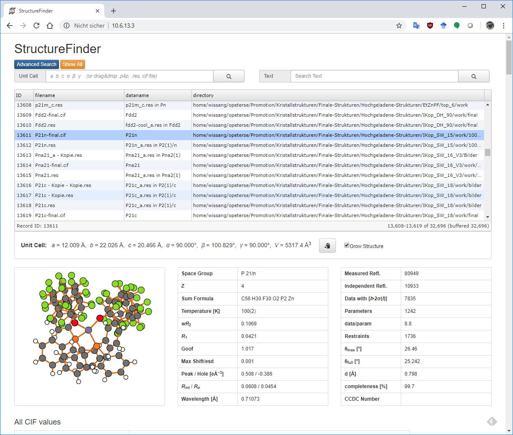

Database Format
===============

The database format is just plain sqlite (`http://www.sqlite.org/ <http://www.sqlite.org/>`_).
You can view the database structure with the
sqlitebrowser (`http://sqlitebrowser.org/ <http://sqlitebrowser.org/>`_) for example.

Plotting of data
================

The "Plot" tab allows plotting of CIF data as ponts or histogram.
A click on a data point scrolls the main table to the respective position of the CIF entry.

CSD search
==========

StructureFinder is able to search for unit cells in the CSD with the CellCheckCSD program.
As soon as CellCheckCSD is installed, you can search the CSD. Double-Click on a result row to get the detailed structure page.

Web Interface
=============

Instead of the regular user interface, you can run StructureFinder as web service.
First, create a database with ./strf_cmd This can be automated with a
cron job to do it regularly.

.. code-block::

   usage: strf_web [-h] [-n HOST] [-p PORT] [-f DBFILENAME] [-d]

    StructureFinder Web Server v73

    options:
      -h, --help            show this help message and exit
      -n HOST, --host HOST
      -p PORT, --port PORT
      -f DBFILENAME, --dbfile DBFILENAME
      -d, --download        Shows a download link in the page bottom

The easiest way is to run 'strf_web' from a directory with a database file: strf_web -f structuredb.sqlite

Be aware that running a web server has security implications. Do not expose this server to the internet
unless you know what you are doing!

The web site should look like this after clicking on a table row:

   The StructureFinder web interface.

Homepage
========

`Back to the StructureFinder home page <https://dkratzert.de/structurefinder.html>`_

