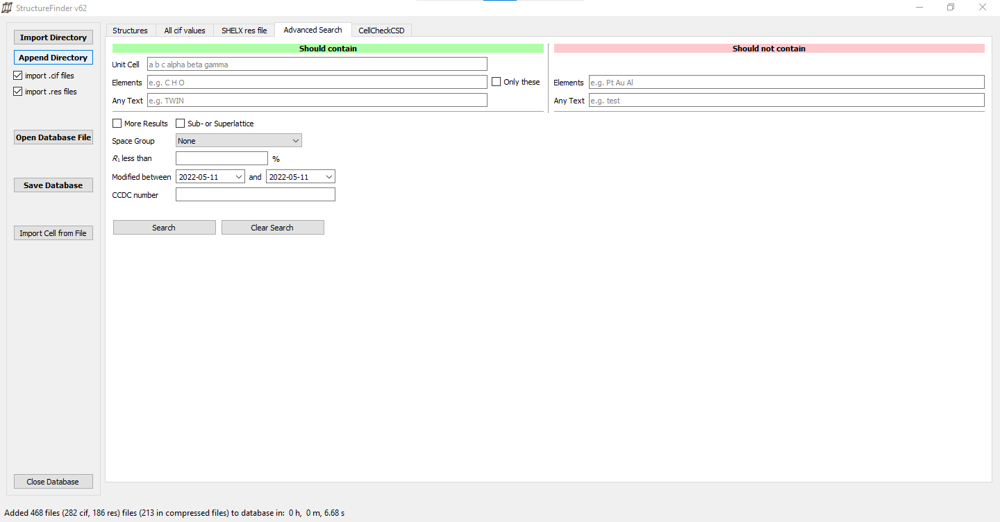

=========
Searching
=========

StructureFinder provides several ways to search for crystal structures in the
database.

Unit Cell Search
----------------

The cell search takes six parameters *a*, *b*, *c*, *α*, *β*, *γ*. The search
is unsharp, so ``10 10 10 90 90 90`` would find the same cell as
``10.00 10.00 10.00 90.00 90.00 90.00``.

The algorithm is a combination of a cell comparison by volume first (for speed)
and subsequent lattice matching. The lattice matching implementation is based on
the `pymatgen <http://pymatgen.org/>`_ project.

The tolerances for the cell search are:

**Regular**
    Volume: ±3 %, length: 0.06 Å, angle: 1.0°

**More results option**
    Volume: ±9 %, length: 0.2 Å, angle: 2.0°

.. tip::

   Double-click on the unit cell display to copy the cell parameters to
   the clipboard.

Text Search
-----------

The text search field searches in the directory, file name, data name, and
.res file text data. You can use wildcards to build patterns:

- ``?`` matches a single character
- ``*`` matches any sequence of characters

For example, ``foo*bar`` means "foo[any text]bar".

The text search also covers author names from these CIF keys:

- ``_audit_author_name``
- ``_audit_contact_author_name``
- ``_publ_contact_author_name``
- ``_publ_contact_author``
- ``_publ_author_name``

Advanced Search
---------------

   Advanced search tab.

The "Advanced Search" tab allows you to search for several options at a time and
also allows to exclude parameters. Available search criteria include:

- Space group
- R1 value range
- Unit cell parameters
- Elements (inclusive and exclusive)
- CCDC number
- Crystal system
- Centering

Suggestions for additional search options are welcome.
