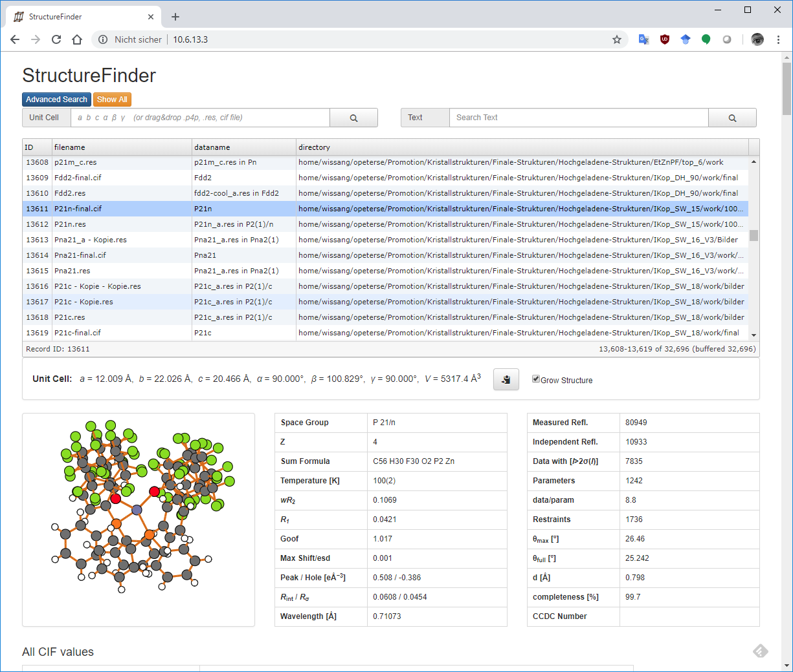

Web Interface
=============

Instead of the regular desktop GUI, you can run StructureFinder as a web service.
This is useful for making a structure database accessible to a team via a web
browser.

Setup
-----

First, create a database using ``strf_cmd``. This can be automated with a
cron job to update the database regularly.

Then start the web server:

.. code-block::

   usage: strf_web [-h] [-n HOST] [-p PORT] [-f DBFILENAME] [-d]

    StructureFinder Web Server v88

    options:
      -h, --help            show this help message and exit
      -n HOST, --host HOST  Host address to bind to (default: 127.0.0.1)
      -p PORT, --port PORT  Port to listen on (default: 8080)
      -f DBFILENAME, --dbfile DBFILENAME
                            Path to the database file (default: structuredb.sqlite)
      -d, --download        Shows a download link in the page bottom

The easiest way to start is:

.. code-block:: bash

   strf_web -f structuredb.sqlite

.. warning::

   Running a web server has security implications. Do not expose this server to
   the internet unless you know what you are doing!

Screenshot
----------

The web site should look like this after clicking on a table row:

   The StructureFinder web interface.

The web interface supports unit cell search, text search, structure display,
and CIF export.
